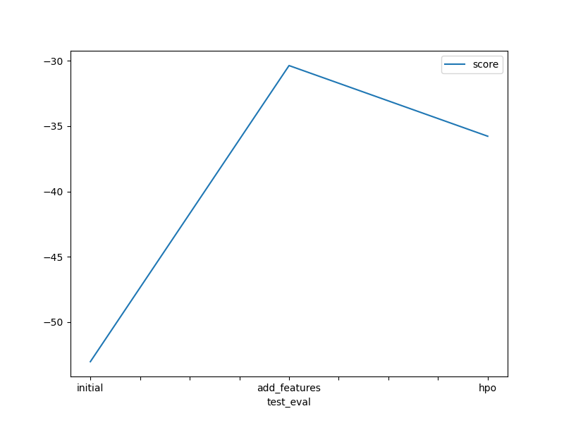
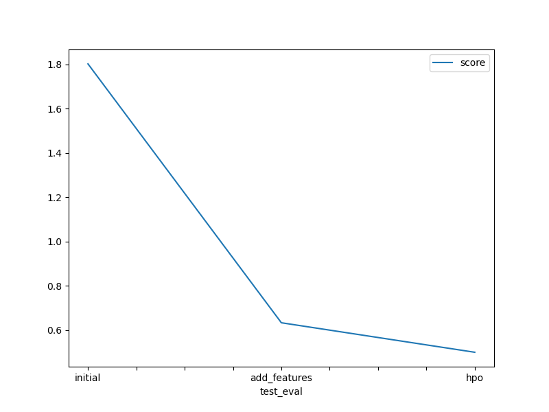

# Report: Predict Bike Sharing Demand with AutoGluon Solution
#### Marcin Tomkiewicz

## Initial Training
### What did you realize when you tried to submit your predictions? What changes were needed to the output of the predictor to submit your results?
The template is designed in a way that allowed me a smooth progress through all the stages of preparation and calculation to the submission of different approaches. The only thing to consider during the submission was to avoid negative values in submission but this was already highlighted in the template itself.

### What was the top ranked model that performed?
WeightedEnsemble_L3 was the initial training top-ranked model, which combines prediction from all the individual models achieved the best prediction performance

## Exploratory data analysis and feature creation
### What did the exploratory analysis find and how did you add additional features?
From the perspective of creation of new variables the datetime column was the initial one that was used. I decided to create year, month, days, hours and even minutes and seconds columns (although the 2 last ones in my opinion do not bring any valuable information to the model). Changing some of the columns to categorical variables was also an improvement. Therefore the second model performed better then the initial one.

### How much better did your model preform after adding additional features and why do you think that is?
After incorporating additional features and categorized data, my model exhibited significant performance improvement. The Kaggle score of root_mean_square_error (RMSE) decreased substantially, indicating a superior result of 0.63277, compared to the initial value of 1.80200. This change can be attributed to the fact that we have extra features and categorized data, which provides additional information for the model. This allows the model to better understand the patterns in the underlying data which improves the predictions

## Hyper parameter tuning
### How much better did your model preform after trying different hyper parameters?
Hyperparameter tuning resulted in further decrease of Kaggle score from 0.63277 to 0.49955. Using ag.space allowed to create an automatic setup for AutoGluon to explore different combinations of hyperparameters during the tunning process

### If you were given more time with this dataset, where do you think you would spend more time?
In my opinion there is still a room for more feature engineering and adding new data to the model based on that. As we saw in the comparison of results the biggest score increase is based on new features added to the model. A further improvement therefore could also be material. Therefore comparing to hyperparameter tunning which also brought some improvement the feature engineering is the key to further improvement.

### Create a table with the models you ran, the hyperparameters modified, and the kaggle score.
|model|NN_TORCH|GBM|CAT|score|
|--|--|--|--|--|
|initial|default|default|default|1.802|
|add_features|default|default|default|0.63277|
|hpo|{'num_epochs': [5, 15], 'activation': space.Categorical('relu', 'softrelu', 'tanh'), 'dropout_prob': space.Real(0.0, 0.6, default=0.1)}|{'num_boost_round': 100, 'num_leaves': space.Int(lower=30, upper=60, default=40)}|{'learning_rate': space.Real(0.0001, 0.1, default=0.005), 'depth': space.Int(lower=1, upper=16, default=8), 'l2_leaf_reg': space.Int(lower=1, upper=1024, default=32)}|0.49955|

### Create a line plot showing the top model score for the three (or more) training runs during the project.

### Create a line plot showing the top kaggle score for the three (or more) prediction submissions during the project.

## Summary
In summary the project demonstrates the importance of both feature engineering and hyperparameter tuning in machine learning workflow. It also shows the capabilities of the Auto ML approach which allows the user very robust approach to creating and select the most valuable model depending on the problem type and results of various models.
